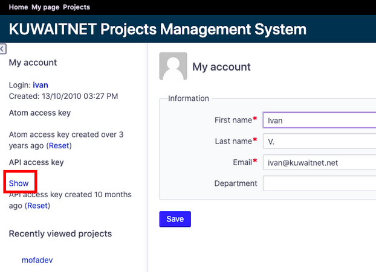
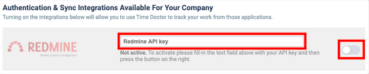
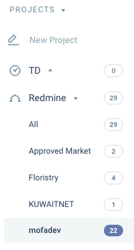

# How-To: Enable Timedoctor Integration With Redmine

## Step 1
* [Go to your](https://pm.kuwaitnet.net/my/account)

* Open left sidebar and click on “Show” button to reveal your API key, copy it.

    

## Step 2
* Go to this [link](https://stormbraces.timedoctor.com/v2/index.php?page=integration_settings)

* Look for Redmine integration, paste your Redmine API key in the form and turn integration ON

    

## Step 3
After some time, Timedoctor will sync all the projects & tasks available for users, and they will be available for selection in Timedoctor desktop application.

