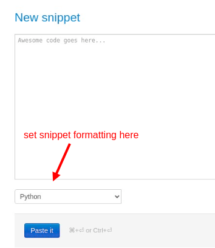
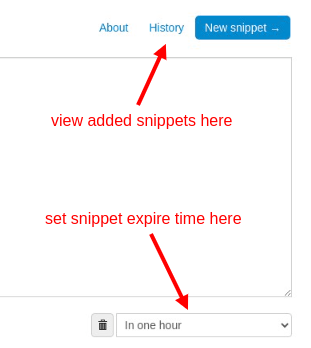
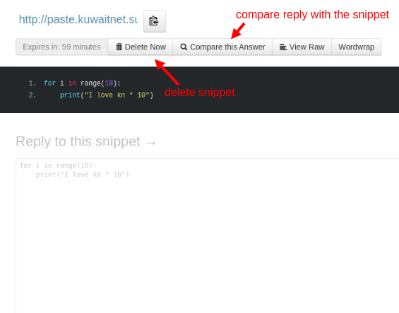

# KUWAITNET Pastebin
A tool used to share snippets via a link.

## Basic Usage
* You can go to [pastebin](https://paste.kuwaitnet.support/)

* You then paste the snippet you want to share inside the textbox.

* You can view your added snippets history from “history” link.

* You can also set the type of the snippet text from the dropdown below the textbox on left hand side.

* You can set the expiration time of the snippet fom the dropdown below the textbox on right hand side.

* Then you can hit the “Paste it” button to be redirected to a link that you can use to share your text snippet.

## Shared link
In the shared link you can:

* View snippet expiration time.

* Delete snippet with the “Delete Now” button.

* View the text in a raw format (without formatting) with the “View Raw” button.

* Wrap words with the “Wordwrap” button

* If the snippet was sent to you, then you can reply to the snippet in the textbox below the snippet.

* If you received a reply, the “Compare this Answer” button will appear which will allow you to view the difference between your snippet and the reply.

