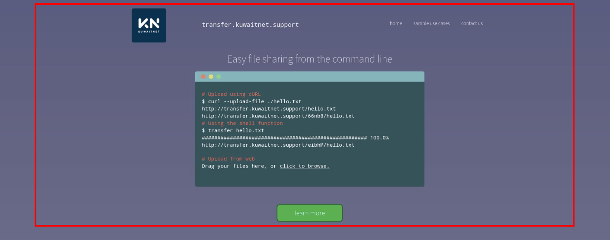

# KUWAITNET Transfer
A tool used to upload files and share them via a link.

## Usage

### Via Linux/MacOS Terminals

#### With curl Command:
* You will need curl for this method, if you don’t have curl you can install it via `sudo apt install curl` for Ubuntu and `brew install curl` command for MacOS.

* Use the curl command to upload a file like the following:

    ``` 
    $ curl --upload-file <file/dir/to/upload> http://transfer.kuwaitnet.support/<name> http://transfer.kuwaitnet.support/66nb8/<name> 
    ```

* The previous command would result into the following output inside the terminal:

    ``` html
    <!DOCTYPE HTML PUBLIC "-//IETF//DTD HTML 2.0//EN">
    <html><head>
    <title>301 Moved Permanently</title>
    </head><body>
    <h1>Moved Permanently</h1>
    <p>The document has moved <a href="https://transfer.kuwaitnet.support/<name>">here</a>.</p>
    </body></html>
    <!DOCTYPE HTML PUBLIC "-//IETF//DTD HTML 2.0//EN">
    <html><head>
    <title>301 Moved Permanently</title>
    </head><body>
    <h1>Moved Permanently</h1>
    <p>The document has moved <a href="https://transfer.kuwaitnet.support/66nb8/<name>">here</a>.</p>
    </body></html>
    ```

* You can use either the links in the href s to share your files.

#### With the shell script:
* Paste this piece of code inside your .bashrc:

``` bash
transfer(){
if [ $# -eq 0 ]; then
     echo "No arguments specified.\nUsage:\n transfer <file|directory>\n ... | transfer <file_name>">&2;return 1;fi;
if tty -s;then
    file="$1";file_name=$(basename "$file");
if [ ! -e "$file" ];then
    echo "$file: No such file or directory">&2;return 1;fi;
if [ -d "$file" ];then
    file_name="$file_name.zip" ,;(cd "$file"&&zip -r -q - .)|curl --progress-bar --upload-file "-" "http://transfer.kuwaitnet.support/$file_name"|tee /dev/null,;
else
    cat "$file"|curl --progress-bar --upload-file "-" "http://transfer.kuwaitnet.support/$file_name"|tee /dev/null;fi;
else file_name=$1;curl --progress-bar --upload-file "-" "http://transfer.kuwaitnet.support/$file_name"|tee /dev/null;fi;
```

* This will add the transfer command and you can use it like the following:

    ``` 
    transfer <file/dir/to/upload> 
    ```

* This would result in the same output as the previous method and you can use the link in the href to share your file.

### Via The Website
* You can go to [transfer](https://transfer.kuwaitnet.support/).

* Then you can drag your file and drop it into the browser page (in the red rectangle).

* After a successful upload, a link will appear that you can use it to share your file.

    

    in the shared link you can:

* Download the shared file using the “Download” button.

* Or scan the displayed QR code to get the shared link.